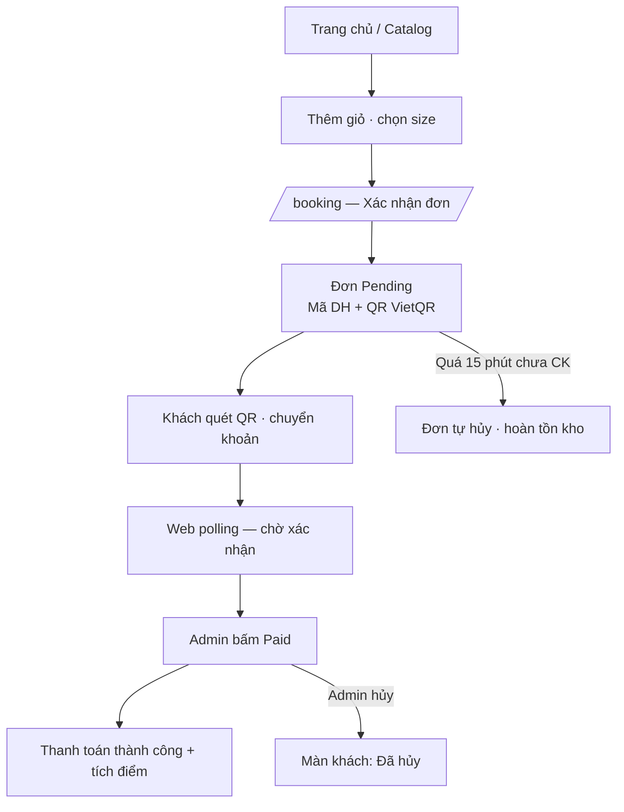
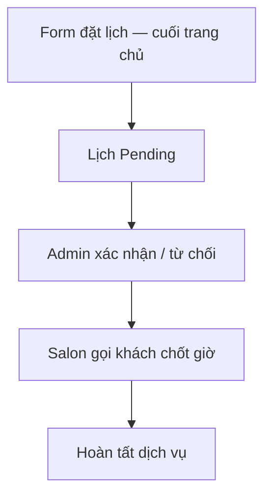
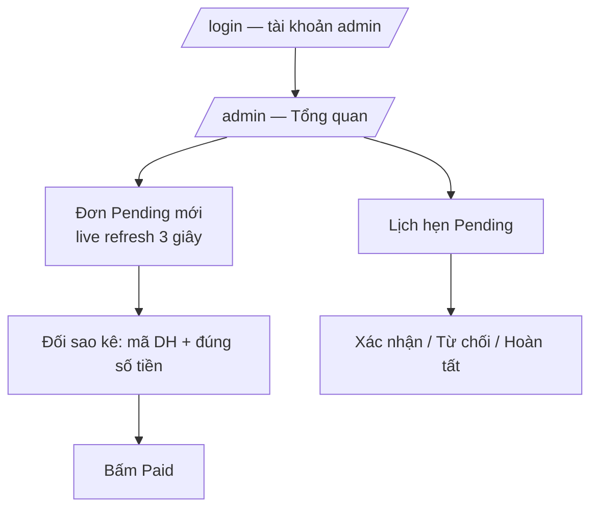

# Trang Tran Hair — Sơ đồ vận hành & kịch bản hướng dẫn khách

> Dùng cho slide, clip video, onboarding nhân viên.  
> Production: https://trangtran-hair.pages.dev

---

## 1. Kiến trúc hệ thống

```
Khách (trình duyệt / điện thoại)
        │
        ▼
Cloudflare Pages          ← Website React (catalog, booking, admin UI)
        │                      Firebase Auth (đăng nhập Google/Email)
        │
        │  HTTPS API
        ▼
Google Cloud Run          ← Backend .NET (đơn hàng, lịch hẹn, điểm…)
        │
        ▼
Firebase
  ├── Authentication
  └── Firestore           ← Dữ liệu salon

VietQR.io (miễn phí)      ← Sinh QR động: số tiền + mã DH theo từng đơn
```

**Thanh toán:** Admin duyệt **Paid** thủ công sau khi đối sao kê — không bắt buộc webhook tự động.

---

## 2. Sơ đồ luồng — Khách mua hàng & QR



---

## 3. Sơ đồ luồng — Đặt lịch (không thanh toán)



---

## 4. Sơ đồ luồng — Admin hàng ngày



---

## 5. Bản đồ trang web

| URL | Chức năng | Ai dùng |
|-----|-----------|---------|
| `/` | Trang chủ, lookbook, **form đặt lịch** | Khách |
| `/catalog` | Bảng giá dịch vụ & sản phẩm | Khách |
| `/booking` | Giỏ hàng, checkout, **QR thanh toán** | Khách |
| `/login` · `/register` | Đăng nhập / đăng ký | Khách |
| `/account` | Hồ sơ, điểm, đơn, lịch hẹn | Khách (login) |
| `/admin` | Quản trị salon | Admin |

---

## 6. Đặt lịch vs Mua hàng

| | **Đặt lịch** | **Mua hàng** |
|---|-------------|--------------|
| **Ở đâu** | Form cuối trang chủ | Catalog → Booking |
| **Mục đích** | Hẹn tư vấn, salon gọi lại | Mua DV/SP + thanh toán |
| **Thanh toán** | Không | QR VietQR + chuyển khoản |
| **Admin xử lý** | `/admin/appointments` | `/admin/orders` |

---

## 7. Quy tắc tích điểm & tồn kho

- **Tích điểm:** 1 điểm / 10.000đ (sau khi đơn Paid)
- **Đổi điểm:** 100 điểm = 10.000đ (phải đăng nhập trước checkout)
- **Giữ tồn sản phẩm:** 15 phút — hết hạn đơn tự hủy, hoàn kho

---

## 8. Kịch bản slide / clip (9 slide)

### Slide 1 — Chào mừng
**Lời thoại:** Xin chào! Đây là website chính thức của Trang Tran Hair — xem bảng giá, đặt lịch, mua sản phẩm và thanh toán chuyển khoản ngay trên điện thoại.  
**Hình:** Logo + hero trang chủ

### Slide 2 — Hai cách dùng
**Lời thoại:** Có hai luồng: (1) **Đặt lịch** — form cuối trang chủ, salon gọi lại trong 24 giờ. (2) **Mua hàng** — Bảng giá, giỏ hàng, thanh toán QR.  
**Hình:** Chia đôi form đặt lịch vs catalog

### Slide 3 — Bảng giá
**Lời thoại:** Vào Bảng giá. Dịch vụ chọn size S/M/L/XL. Sản phẩm hiện tồn kho. Bấm **Thêm** vào giỏ.  
**Hình:** Quay màn /catalog

### Slide 4 — Xác nhận đơn
**Lời thoại:** Vào Giỏ hàng & Thanh toán. Nhập họ tên, SĐT. Có thể dùng mã khuyến mãi hoặc đổi điểm nếu đã đăng nhập. Bấm **Xác nhận & Thanh toán**.  
**Hình:** Form checkout

### Slide 5 — Quét QR (quan trọng)
**Lời thoại:** Màn hình hiện **mã QR**. Mở app ngân hàng → **Quét mã**. Số tiền và nội dung mã đơn **DH...** điền sẵn — bạn chỉ xác thực OTP hoặc vân tay rồi chuyển.  
**Hình:** Zoom QR + mã DH

### Slide 6 — Chờ xác nhận
**Lời thoại:** Sau khi chuyển, trang **tự cập nhật** — không cần F5. Salon kiểm tra sao kê và xác nhận. Xong bạn thấy **Thanh toán thành công**.  
**Hình:** Spinner chờ → màn success

### Slide 7 — Tài khoản & điểm
**Lời thoại:** Đăng ký email hoặc Google để xem đơn, lịch và điểm. 10.000đ = 1 điểm. 100 điểm giảm 10.000đ lần sau.  
**Hình:** /account

### Slide 8 — Lưu ý
**Lời thoại:** Sản phẩm giữ tồn **15 phút**. Chuyển đúng số tiền và nội dung **DH...**. Salon hủy đơn thì trang hiện **Đã hủy** — không chuyển thêm.  
**Hình:** Callout 15 phút

### Slide 9 — Liên hệ
**Lời thoại:** Gọi **0986 586 058** hoặc nhắn Facebook, Instagram, TikTok. Hẹn gặp bạn tại Trang Tran Hair, Sóc Trăng!  
**Hình:** Footer liên hệ

### Đóng clip
*"Truy cập trangtran-hair.pages.dev — Where hair becomes art."*

---

## 9. Checklist admin — xác nhận thanh toán

1. Mở app ngân hàng — tìm giao dịch vừa vào  
2. Số tiền khớp tổng đơn trên portal  
3. Nội dung CK chứa mã **DH...**  
4. `/admin/orders` → **Xác nhận đã thanh toán**  
5. Khách tự thấy success trên web  

---

*Tài liệu đồng bộ với canvas: `canvases/trangtran-operations.canvas.tsx`*
